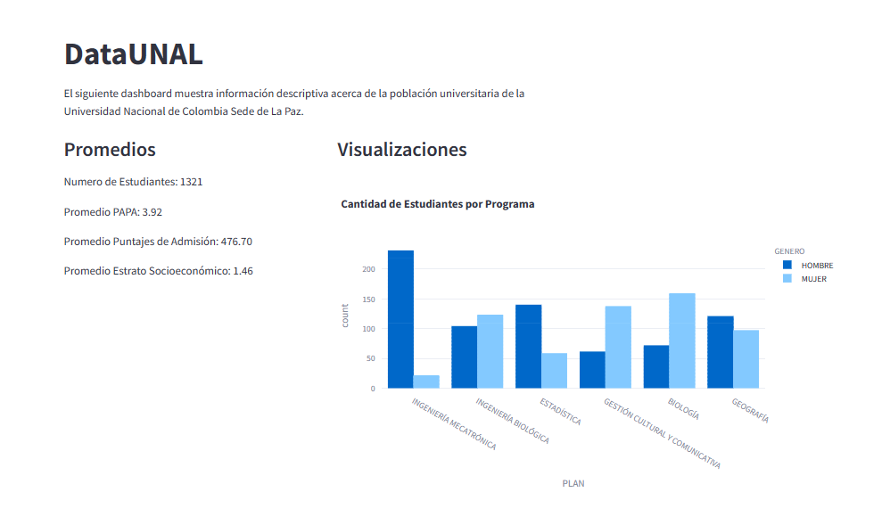

# UNAL Insights 🚀

## Descripción del Proyecto

UNAL Insights es un proyecto que utiliza análisis de datos y visualizaciones interactivas para proporcionar información detallada sobre la población estudiantil de la Universidad Nacional de Colombia Sede de La Paz. Este dashboard interactivo está diseñado para ofrecer una visión general de aspectos académicos y demográficos, brindando a los usuarios una herramienta valiosa para comprender mejor la composición y características de los estudiantes.

## Características Principales

-   **Secciones Interactivas:** El dashboard cuenta con secciones interactivas que permiten a los usuarios explorar diferentes aspectos de la población estudiantil.

-   **Visualizaciones Atractivas:** Utiliza gráficos interactivos para representar información académica y demográfica de manera clara y atractiva.

-   **Filtrado Personalizado:** Los usuarios pueden personalizar la visualización según sus necesidades mediante filtros y controles interactivos.

## Tecnologías Utilizadas

-   **Python:** El backend del proyecto está desarrollado en Python, aprovechando bibliotecas como Pandas para el manejo de datos.

-   **Streamlit:** Se utiliza Streamlit como marco de desarrollo para crear interfaces web interactivas con Python.

-   **Plotly Express:** Para la generación de visualizaciones interactivas.

## Cómo Ejecutar el Proyecto

1. Clona este repositorio.
2. Instala las dependencias ejecutando `pip install -r requirements.txt`.
3. Ejecuta la aplicación con `streamlit run tu_app.py`.

## Estructura del Proyecto

|-- UNAL-Insights
|-- dataset.csv
|-- tu_app.py
|-- requirements.txt
|-- README.md

## Capturas de Pantalla

## Licencia

Este proyecto está bajo la Licencia MIT. Consulta el archivo [LICENSE](LICENSE) para obtener más detalles.

¡Gracias por explorar UNAL Insights! 🎓📊
